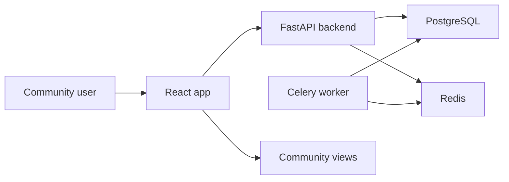
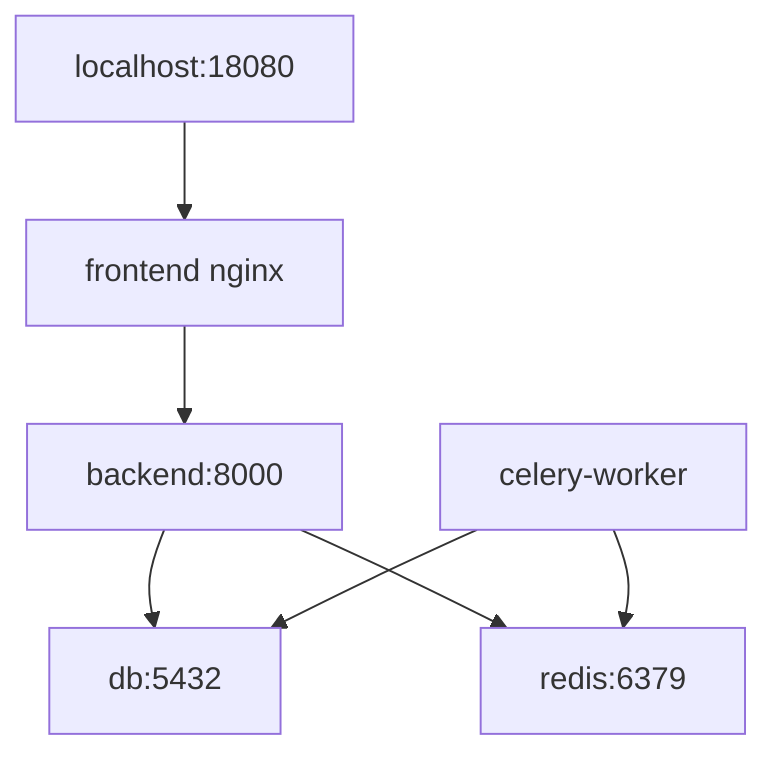
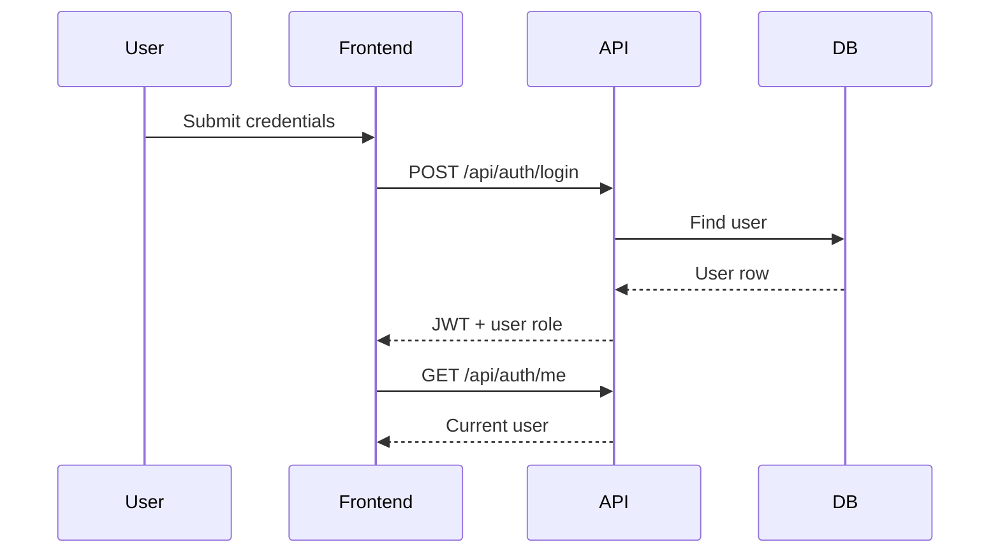
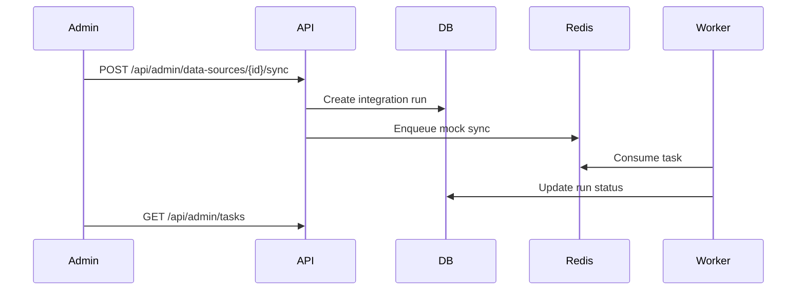
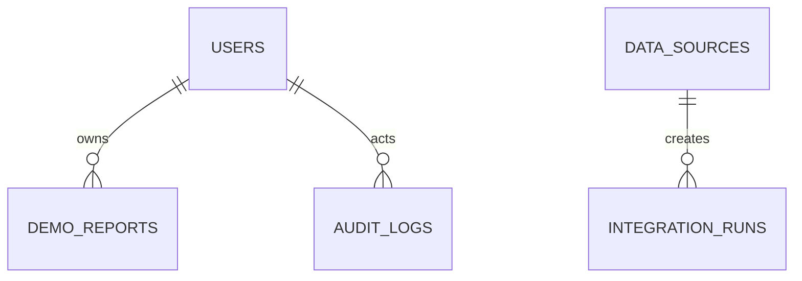

# Architecture

## System Context

```mermaid
flowchart LR
  User["Community user"] --> Frontend["React app"]
  Frontend --> API["FastAPI backend"]
  API --> DB["PostgreSQL"]
  API --> Redis["Redis"]
  Worker["Celery worker"] --> Redis
  Worker --> DB
  Frontend --> Views["Community views"]
```

## Docker Compose

```mermaid
flowchart TB
  Browser["localhost:18080"] --> Nginx["frontend nginx"]
  Nginx --> Backend["backend:8000"]
  Backend --> Postgres["db:5432"]
  Backend --> Redis["redis:6379"]
  Worker["celery-worker"] --> Redis
  Worker --> Postgres
```

## Login Sequence

```mermaid
sequenceDiagram
  participant U as User
  participant F as Frontend
  participant A as API
  participant D as DB
  U->>F: Submit credentials
  F->>A: POST /api/auth/login
  A->>D: Find user
  D-->>A: User row
  A-->>F: JWT + user role
  F->>A: GET /api/auth/me
  A-->>F: Current user
```

## Admin Data Governance

```mermaid
sequenceDiagram
  participant Admin
  participant API
  participant DB
  participant Redis
  participant Worker
  Admin->>API: POST /api/admin/data-sources/{id}/sync
  API->>DB: Create integration run
  API->>Redis: Enqueue mock sync
  Worker->>Redis: Consume task
  Worker->>DB: Update run status
  Admin->>API: GET /api/admin/tasks
```

## Community Database

```mermaid
erDiagram
  USERS ||--o{ DEMO_REPORTS : owns
  DATA_SOURCES ||--o{ INTEGRATION_RUNS : creates
  USERS ||--o{ AUDIT_LOGS : acts
```

This is a public demo schema for local development.
