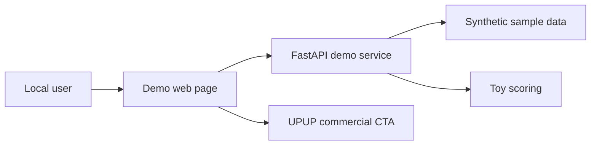
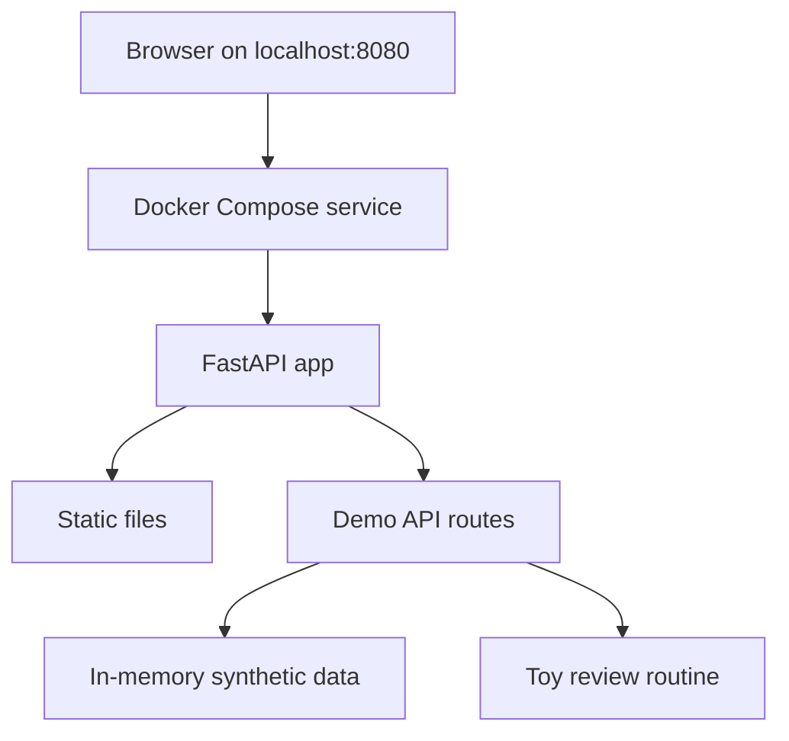
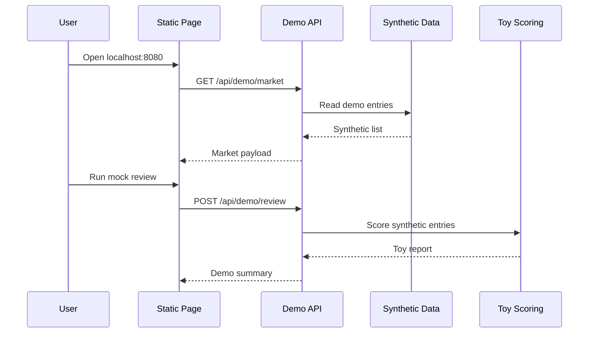
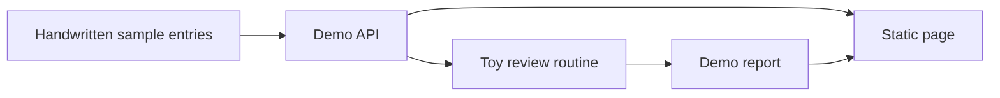

# Architecture

This document describes the minimal public demo only.

## System Context

## Demo Container

## Local Request Sequence

## Sample Data Flow

## Notes

No real market feed, production scoring, user account system, payment system, or production deployment topology is included.
