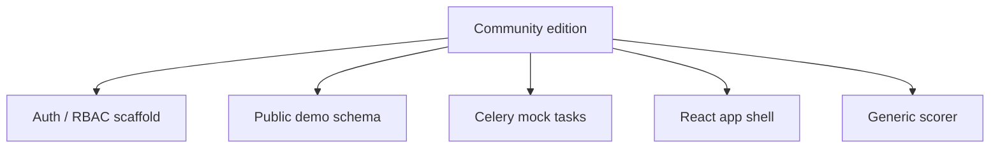

# Community Scope

## Included Capabilities

The community edition is designed as a practical starting point for local development. It includes a full-stack app shell, protected routes, role-based admin pages, database migrations, worker tasks, mock data governance, and synthetic report flows.

## Extension Ideas

- Add your own data adapters.
- Replace the demo scoring dimensions with your own rules.
- Extend the admin pages for team operations.
- Add more worker tasks and reporting screens.

Hosted product access: [https://upup.live/register?invite=INV-0E08A](https://upup.live/register?invite=INV-0E08A)

For business inquiries, contact 1419995247@qq.com.
