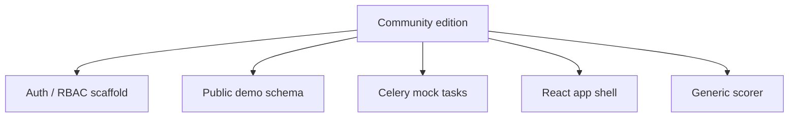
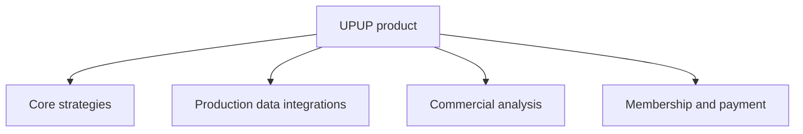

# Open-Core Boundary

## Public

```mermaid
flowchart TB
  Public["Community edition"] --> Auth["Auth / RBAC scaffold"]
  Public --> DB["Public demo schema"]
  Public --> Tasks["Celery mock tasks"]
  Public --> UI["React app shell"]
  Public --> Score["Generic scorer"]
```

## Commercial

```mermaid
flowchart TB
  Commercial["UPUP product"] --> Strategies["Core strategies"]
  Commercial --> Data["Production data integrations"]
  Commercial --> Reports["Commercial analysis"]
  Commercial --> Billing["Membership and payment"]
```

The public repository should remain useful as an architecture scaffold while keeping commercial strategy and data assets private.
