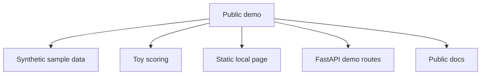
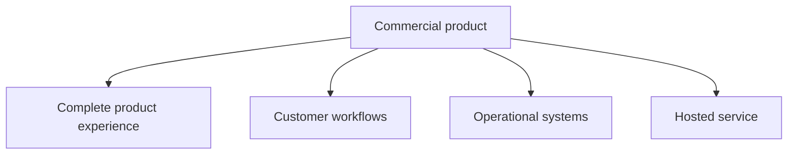

# Open-Core Boundary

This repository is designed as a small public demo for education and evaluation.

## Public Demo

## Commercial Product

## Boundary Rule

The public demo should stay small, local, synthetic, and educational. It should not include real data pipelines, production scoring, customer data, payment flows, admin features, or hosted deployment details.
