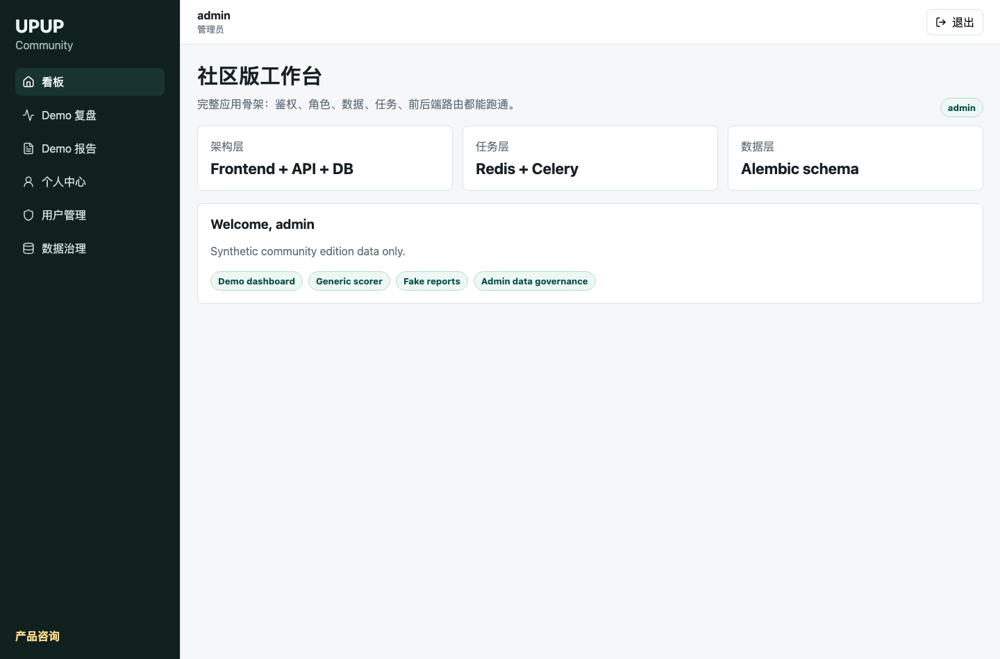
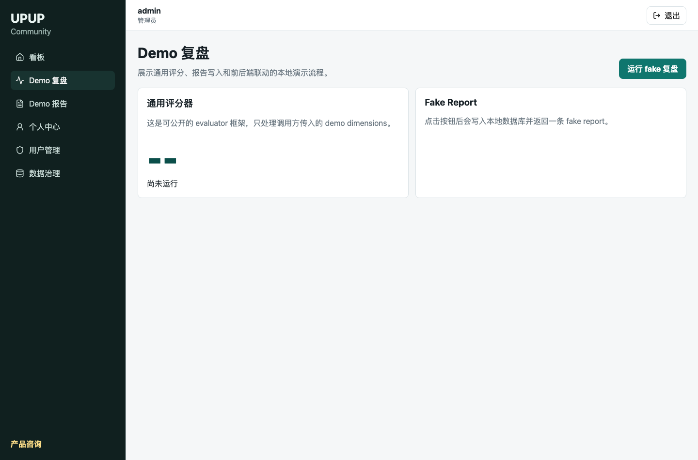
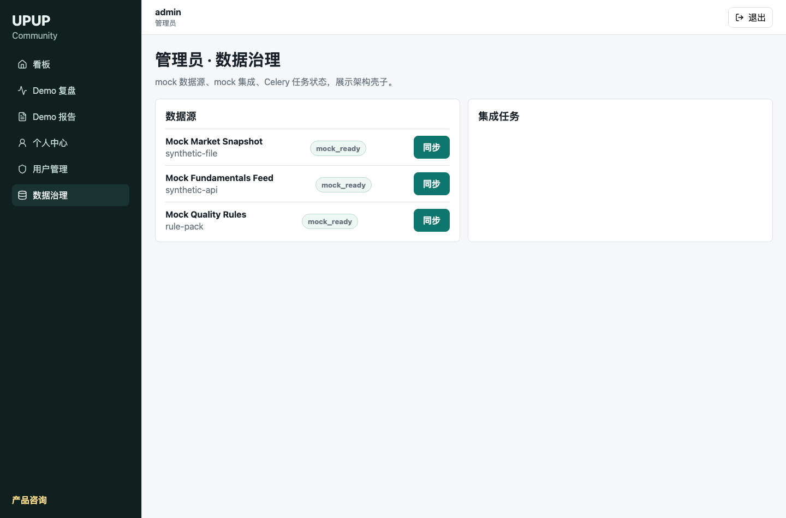

# Product Preview

These screenshots show the community edition running locally with synthetic demo data.

The community edition focuses on a runnable local scaffold: app shell, API contracts, authentication, admin workflows, task processing, and synthetic demo data.

## Community Dashboard

## Demo Review

## Admin Data Governance

