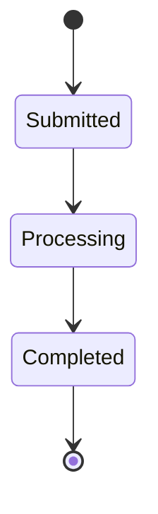
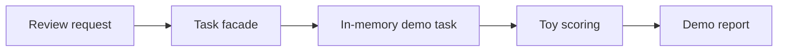

# Task Architecture

The public demo uses an in-memory task abstraction so users can see the shape of an async review flow without running external services.

## Mock Task Lifecycle

## Queue Abstraction

## Production Boundary

The commercial product may use dedicated workers and backing infrastructure for long-running jobs. This public demo does not include those implementations or any production configuration.
