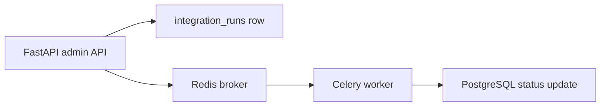

# Task Architecture

Celery and Redis are included so the community edition can demonstrate asynchronous task processing.

The task name is `community.fake_data_source_sync`. It is a mock task for local task-flow demos.
