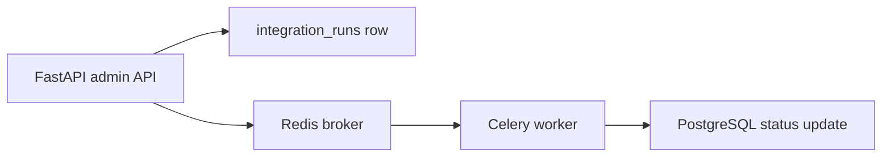

# Task Architecture

Celery and Redis are included so the community edition has the same architectural shape as a production async system.

The task name is `community.fake_data_source_sync`. It is a mock task and does not contain production queue names or scheduling logic.
